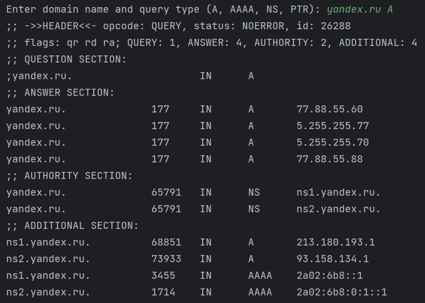
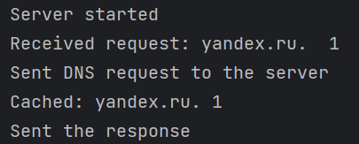
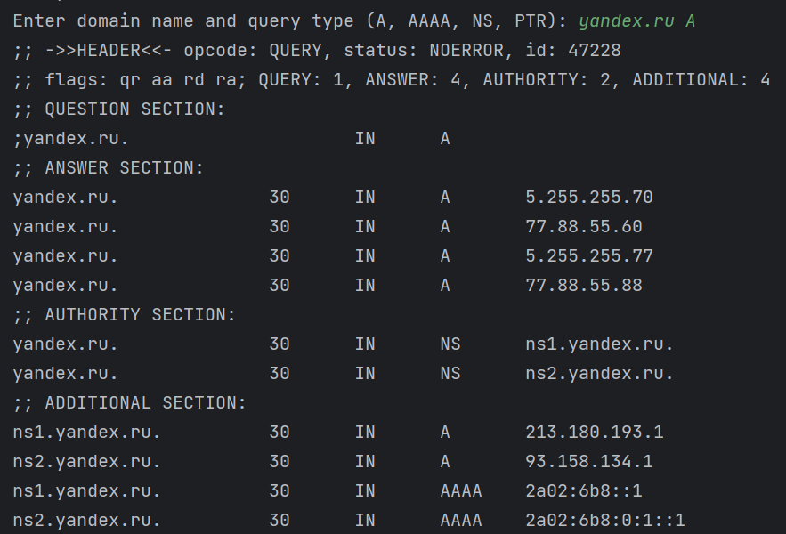
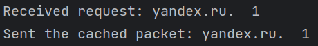
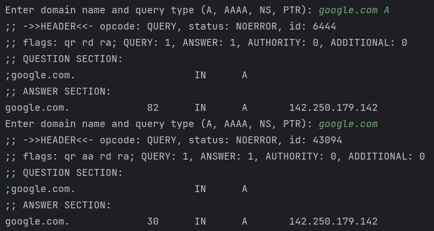
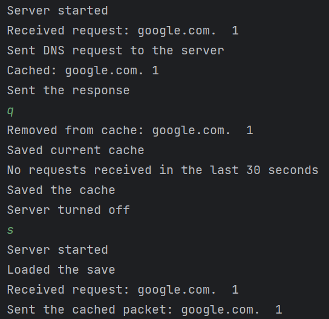

 # Кэширующий DNS сервер
 Короткова Мария КН-201

 Постановка задачи:
>Сервер прослушивает 53 порт. При первом запуске кэш пустой. Сервер получает от клиента рекурсивный запрос и выполняет разрешение запроса. Получив ответ, сервер разбирает пакет ответа, извлекает из него ВСЮ полезную информацию, т. е. все ресурсные записи, а не только то, о чем спрашивал клиент. Полученная информация сохраняется в кэше сервера. Сервер регулярно просматривает кэш и удаляет просроченные записи (использует поле TTL).
Сервер не должен терять работоспособность (уходить в бесконечное ожидание, падать с
ошибкой и т. д.), если старший сервер почему-то не ответил на запрос. Во время штатного выключения сервер сериализует данные из кэша, сохраняет их на диск. При повторных запусках
сервер считывает данные с диска и удаляет просроченные записи, инициализирует таким образом свой кэш. 

Запуск программы:
>Запускаем dns_client и dns_server

Далее в dns_client вводим доменное имя и тип запроса(A, AAAA, NS, PTR)

Например:
>yandex.ru A

Ответ на строне dns_client:

Ответ на строне dns_server:

Далее опять вводим:
>yandex.ru A

И получаем результат(данные получаются из кэша):

dns_client:

dns_server:

Сервер регулярно просматривает кэш и удаляет просроченные записи (использует поле TTL):

Теперь сделаем проверку во время штатного выключения сервера

Результаты:

dns_client:

dns_server:

Как мы видим во время штатного выключения сервер сериализует данные из кэша, сохраняет их на диск. При повторных запусках сервер считывает данные с диска и удаляет просроченные записи, инициализирует таким образом свой кэш.